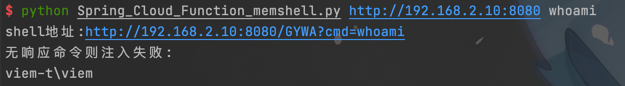
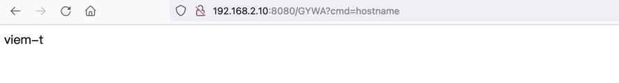

# Spring Cloud Function memshell
### 此脚本不完善,仅作学习用途,请勿非法使用

Spring Cloud Function这个洞没找到方便的回显利用exp,干脆直接写一个cmdshell用以回显.
依旧是基于 [c0ny1](https://gv7.me/articles/2022/the-spring-cloud-gateway-inject-memshell-through-spel-expressions/)
大佬的博客的poc.

测试环境:
```
下载https://github.com/spring-cloud/spring-cloud-function/archive/refs/tags/v3.1.6.zip
直接用idea启动function-sample-pojo 即可

```


```
eg:xx.py http://127.0.0.1:8080 whoami
```




